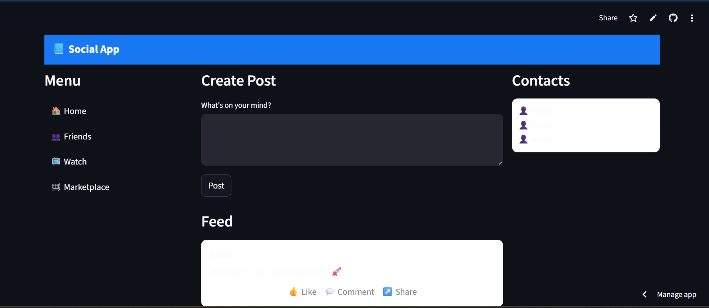

# streamlit-social-ui
A Facebook-inspired social media homepage UI built using Streamlit.
# 📘 Social Media UI (Streamlit)


---

## 🌐 Live Demo

### 🔐 Login Page

👉 https://app-social-ui-s9x4ekmzfhwwezsurkizay.streamlit.app/

### 🏠 Homepage UI

👉 https://app-social-ui-83abxqowbwirj9t6kvmrcw.streamlit.app/

---

## 📸 Preview

### 🔐 Login UI

<p align="center">
  
</p>

### 🏠 Homepage UI

<p align="center">
  
  
</p>

---

## 📌 Overview

This project is a **Facebook-inspired social media UI** built using Streamlit.
It demonstrates modern UI layout design including authentication screens and homepage feed structure.

---

## ✨ Features

### 🔐 Login Page

* Clean login card UI
* Email & password input fields
* Styled buttons and layout

### 🏠 Homepage

* 📘 Top navigation bar
* 📂 Sidebar menu
* 📝 Post creation UI
* 📰 Feed layout (posts display)
* 👥 Contacts panel

---

## 🛠 Tech Stack

* Python
* Streamlit

---

## 📂 Project Structure

```bash
streamlit-social-ui/
│── app.py
│── requirements.txt
│── login.png
│── Homepage1.png
│── Homepage2.png
│── README.md
```

---

## ⚙️ Run Locally

```bash
# Install dependencies
pip install -r requirements.txt

# Run app
streamlit run app.py
```

---

## 🚀 Deployment

This project is deployed using Streamlit Cloud:

* Uploaded project to GitHub
* Connected repository to Streamlit Cloud
* Deployed login and homepage UI separately
* Generated public URLs

---

## 📈 Future Improvements

* 🔐 Add real authentication system
* 💾 Integrate database (user + posts)
* ❤️ Like, comment, and share functionality
* 📱 Mobile responsive UI
* 🌐 Full-stack social media application

---

## ⭐ Support

If you found this project useful, consider giving it a ⭐ on GitHub!

---

## 👩‍💻 Author

**Ankita Ghosh**

---
